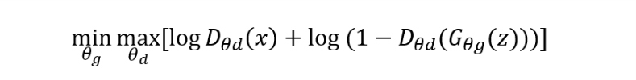
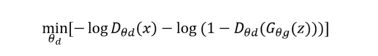
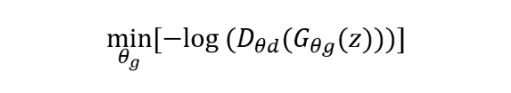

# GAN on Fashion MNIST dataset in Keras
## Overview
GAN or Generative Adversarial Networks is an unsupervised learning technique which can generate data after learning from training data. GAN can be divided into two networks, i.e. a generator network and a discriminator network. The generator network takes in random noise to produce an image. The discriminator tries to identify if the data given to it is synthetic or real training data. They are trained in the form of a minimax game based on the function below. The Discriminator tries to maximize this function while the generator tries to do the opposite.

 
Here, x is the real data and z is randomly generated noise.
## Training Process:
The loss function used in all the model is binary cross entropy. Cross entropy is calculated as loss = – log (1– yprediction) if y = 0 else if y =1 it is calculated as loss = -log(yprediction). Adam optimizer was used to optimize the network. The above loss function has to be minimized to improve the discriminator performance i.e.

When training the combined network, the discriminator is given fake images from the generator, but the network is trained with labels set to 1 or valid. Note that while training the combined network the parameters in the discriminator network is non-trainable. 

The training was done using the below steps.
	
1. The generator model which upscales the noise to the size of an image using convolutional layers and a discriminator model which is a CNN were build and saved as model separately.
2. A combined model is then created by using the output of the generator model and feeding it to the discriminator model. In this model the discriminator layers are non-trainable parameters.
3. First a batch of generator data from the generator network is used to train the discriminator.
4. Then a second batch of real data of the same size is used to train the discriminator.
5. Then the generator is trained as a whole with the combined network, but the discriminator network layers are not updated as they will now be non-trainable layers.
6. This process is repeated for multiple epochs by repeating from step 3.

## Clone this project to your computer:

```
git clone https://github.com/Mayavan/GAN_FashionMNIST.git
```
## Dependencies

* Keras
* Tensorflow
* CUDA 8.0
* Python 3.6

